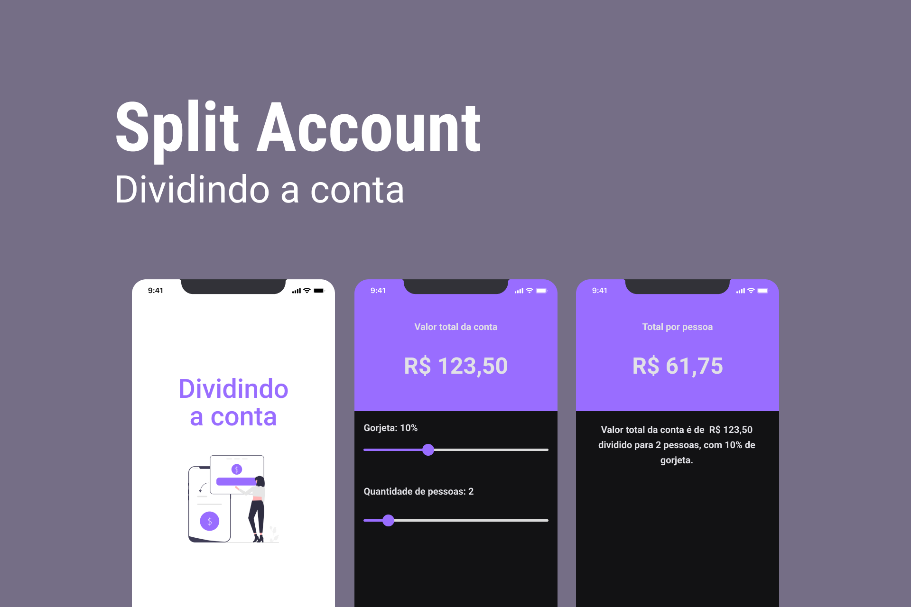

  <h1>Split Account</h1>

  <a href="#-tecnologias">Tecnologias</a>&nbsp;&nbsp;&nbsp;|&nbsp;&nbsp;&nbsp;
  <a href="#-projeto">Projeto</a>&nbsp;&nbsp;&nbsp;|&nbsp;&nbsp;&nbsp;
  <a href="#-layout">Layout</a>&nbsp;&nbsp;&nbsp;|&nbsp;&nbsp;&nbsp;
  <a href="#-instalacao">Instalação</a>

 

  

## 🚀 Tecnologias

Esse projeto foi desenvolvido com as seguintes tecnologias:

- Typescript
- Expo
- React Native
- React Navigation
- Native Base

## 💻 Projeto

O Split Account é uma aplicação que tem o objetivo de facilitar a divisão da conta quando se estar em um ambiente onde necessita repartir os custos com outras pessoas de forma fácil e rápida. Com o desenvolvimento dessa aplicação básica consigo colocar em prática meus estudos em react native.

## 🔖 Layout

No link abaixo você encontra o layout do projeto mobile. Lembrando que você precisa ter uma conta no [Figma](http://figma.com/) para acessá-lo.

- [Layout Mobile](https://www.figma.com/file/7WdUDkj8r2pmD33SQrG7Zy/Split-Account)

## Instalação

- Você precisa do nodejs e do expo-cli na sua máquina
- Clone o repositório do git
- Instale as dependências com yarn dentro do diretório
- E execute expo start

## Demo do aplicativo

- Instale o expo go no seu celular e leia o QRCode

---

Feito com ♥ by Lincoln silva

- [Instagram](https://www.instagram.com/jotalincoln/)
- [Github](https://github.com/LincolnSA)
- [Portfólio](https://lincolnsa.github.io/portfolio/)
- [devlincolnsilva@gmail.com](mailto:devlincolnsilva@gmail.com?subject=Oi%20lincoln)
